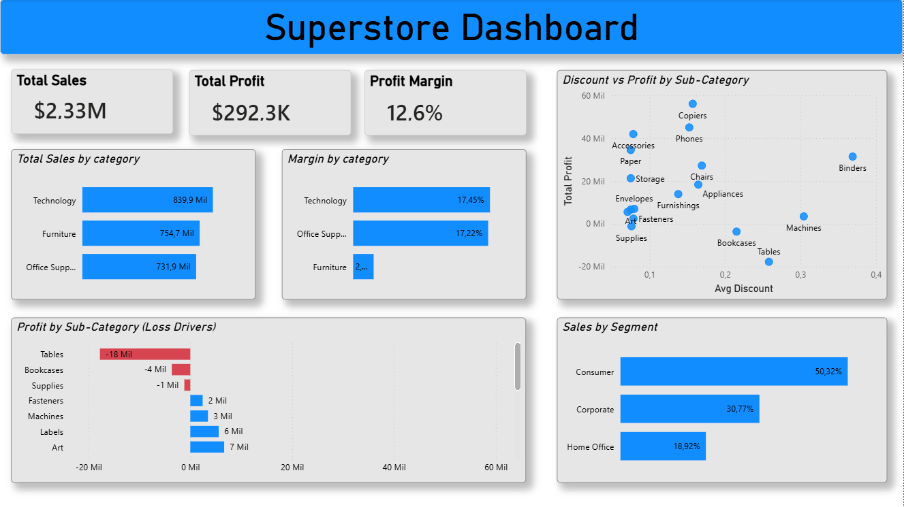

## Superstore Sales Analysis

This project analyzes sales data from a retail buisness to identify profitability issues and key performance drivers.

The analysis was conducted using SQL for data preparation and Power BI for visualization.

## Dashboard

## Key Insights

- Technology is the most profitable category.
- Furniture category shows strong sales but significantly lower profitability compared to other categories.
- Losses are concentrated in specific sub-categories, especially Tables and Bookcases.
- The issue is driven by negative profit margins, indicating that the company is losing money per sale in these areas.
- Profitability is not primarily driven by discounts, but by structural margin issues.

## Tools Used

- SQL (data cleaning and analysis)
- Power BI (data visualization)
- Excel / CSV (data source)

## Project Structure

- data/ → raw and cleaned datasets
- sql/ → queries used for analysis
- dashboard/ → Power BI file
